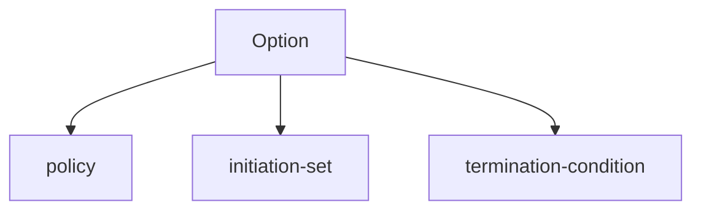

# Options 

What are [[options]]?

An option is a temporally extended-behavior. Option $O_i = (\pi_i, \mathcal{I}_i, \beta_i)$ is composed of

* a policy $\pi_i: \mathcal{S}_t \rightarrow \mathcal{A}_t$
* an initiation set $\mathcal{I}_i$ that defines states where the policy may be enacted
* a termination condition $\beta_i : \mathcal{S}_t \rightarrow [0,1]$

Why are options useful? Options were useful because they enabled breaking behavior into chunks. By having a policy *over* options, this enabled (a) easy composition of behaviors or "skills" and (b) credit assignment over long time-horizons. From a [[representation-learning-utility]] perspective, one potential utility of having an option over policies is that the low-level and high-level policies can maintain separate representations of state. If the low-level policy has an empty history when it is initiated, this may facilitate its generalization to broad range of settings when it is applied.

References:
1. [Original Options Paper](https://people.cs.umass.edu/~barto/courses/cs687/Sutton-Precup-Singh-AIJ99.pdf)